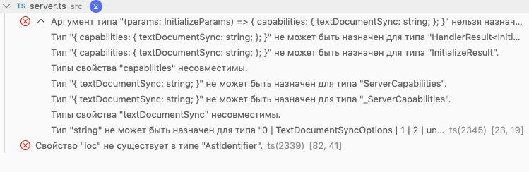

# Задание 3. Найдите ошибки
Работу над заданием я решила разбить на 3 этапа:
  - [Исправить ошибки компиляции](#%d0%98%d1%81%d0%bf%d1%80%d0%b0%d0%b2%d0%b8%d1%82%d1%8c-%d0%be%d1%88%d0%b8%d0%b1%d0%ba%d0%b8-%d0%bb%d0%b8%d0%bd%d1%82%d0%b5%d1%80%d0%b0)
  - [Восстановить работоспособность расширения](#%d0%92%d0%be%d1%81%d1%81%d1%82%d0%b0%d0%bd%d0%be%d0%b2%d0%b8%d1%82%d1%8c-%d1%80%d0%b0%d0%b1%d0%be%d1%82%d0%be%d1%81%d0%bf%d0%be%d1%81%d0%be%d0%b1%d0%bd%d0%be%d1%81%d1%82%d1%8c-%d1%80%d0%b0%d1%81%d1%88%d0%b8%d1%80%d0%b5%d0%bd%d0%b8%d1%8f)
  - [Исправить стилистические ошибки](#%d0%98%d1%81%d0%bf%d1%80%d0%b0%d0%b2%d0%b8%d1%82%d1%8c-%d1%81%d1%82%d0%b8%d0%bb%d0%b8%d1%81%d1%82%d0%b8%d1%87%d0%b5%d1%81%d0%ba%d0%b8%d0%b5-%d0%be%d1%88%d0%b8%d0%b1%d0%ba%d0%b8)

## Исправить ошибки компиляции
На вкладке "проблемы" было всего 2 ошибки в файле `server.ts`:

1. **Поле `textDocumentSync` не может быть типа `string`.**

Поле `textDocumentSync` отвечает за режим синхронизации (полной или инкрементальной) между VS Code и языковым сервером. Поле может быть следующих типов: `TextDocumentSyncOptions | TextDocumentSyncKind`. Я поставила значение `docs.syncKind`, означающее режим полной синхронизации.

2. **Свойство `loc` не существует в типе `AstIdentifier`.**

Проблема решилась добавлением поля `loc: AstLocation;` в интерфейс `AstIdentifier` (файл `json-to-ast.d.ts`).

## Восстановить работоспособность расширения
- **Превью интерфейса доступно для всех файлов `.json`.**

Превью доступно, за это отвечает поле `activationEvents` в `package.json`.
- **Превью открывается в отдельной вкладке при нажатии кнопки сверху от редактора**

Превью открывается, но вместо отрисовки блоков в виде прямоугольников, отображается текст `{{content}}`. Cтрока {{content}} — это текущее содержимое тега body, которое должно замениться на верстку блоков.

Работа расширения начинается с функции `activate`. Она запускается, когда срабатывают события из массива `activationEvents` в `package.json` (в нашем случае это вызов команды `showPreviewToSide` или наличие файла с расширением `json`). В этой функции регистрируется команда `previewCommand`, которая как раз и ответственна за открытие превью файла. При регистрации команды передается идентификатор команды и колбэк.

В колбэке вызывается функция `openPreview`, в которой определяется, существует ли уже вкладка с превью или нужно проинициализировать новую. Здесь также запускается функция `updateContent`, в которой определяется, что именно нужно отрисовать в превью.

В функции updateContent мной как раз и была обнаружена ошибка, не позволяющая отрисовать контент. **Регулярным выражением `/{{\s+(\w+)\s+}}/g` ищется текст типа `{{ content }}`, с лишними пробелами внутри.** Если пробелы в выражении сделать не обязательными, то можно будет увидеть превью.
Теперь регулряное выражение выглядит так: **`/{{\s*(\w+)\s*}}/g`**

Помимо этого **в превью не отрисовываются стили, заданные для блоков**. Все из-за того, что в html-файле задан относительный путь, а нужно передать в href путь до директории с расширением. Поэтому заменим адрес `./preview/style.css` на `{{mediaPath}}/preview/style.css`.

После этого в консоли инструментов разработчика **возникла ошибка `Failed to load resource: net::ERR_UNKNOWN_URL_SCHEME`**. Решением проблемы стала замена в функции `getMediaPath` URI-схемы. Помимо этого я убрала лишний символ `/` в конце.

До:
```
const getMediaPath = (context: vscode.ExtensionContext) => vscode.Uri
    .file(context.extensionPath)
    .with({ scheme: "resource"})
    .toString() + '/';
```
После:
```
const getMediaPath = (context: vscode.ExtensionContext) => vscode.Uri
    .file(context.extensionPath)
    .with({ scheme: "vscode-resource"})
    .toString();
```

**В самом файле со стилями заменила `.div` на `div`** и превью отрисовалось корректно.(превью со стилями-заглушкой можно посмотреть в ветке `with-templage-styles`)

- **Сейчас превью отображает структуру блоков в виде прямоугольников. Реализуйте отображение превью с помощью вёрстки и JS из первого задания.**

Для решения этой задачи перенесла в папку `preview` верстку и js из первого задания, а в файле `index.html` подключила скрипт. Верстка отображается корректно, темы переключаются.

- **Линтер подсвечивает ошибочное место в файле и отображает сообщение при наведении мыши.**

Не происходило создание языкового сервера и запуск клиента, не работал вывод в консоль на сервере. Заменила код
```
new SettingMonitor(client, 'example.enable').start()
```
на
```
client.start()
```
и проблема решилась. Вывод в консоль с помощью `conn.console.log('text')` теперь работает.

- **При запуске расширения во вкладке вывод появилась ошибка**
  
```
UnhandledPromiseRejectionWarning: SyntaxError: Unexpected symbol <f> at 1:1
1 | file:///Users/anya/Documents/%D0%9D%D0%BE%D0%B2%D0%B0%D1%8F%20%D0%BF%D0%B0%D0%BF%D0%BA%D0%B0/index.json
```

Ее причина в том, что в функции `validateTextDocument` файла `server.js` вместо текстового содержимого файла в функции используется его URI. Чтобы это исправить, заменила код
```
const json = textDocument.uri;
```
на
```
const json = textDocument.getText();
```

- **Клиент запущен, но ошибки не подсвечиваются**. Происходит это потому, что массив `errors` в ходе выполнения функции `walk` (файл `linter.ts`) не мутируется. Метод `concat` в колбэках, передаваемых в `walk`, создает новый массив, а не изменяет текущий. Заменила метод `concat` на `push` и теперь ошибки подсвечиваются.

- Добавила конфигурацию `attach` в `launch.json` для включения режима дебага языкового сервера.

- **Линтер-заглушка определяет ошибки некорректно**. Он проверяет все объекты на наличие поля `block`, хотя в объекте с модификаторами поля `block` быть не должно. Помимо этого, если поле `block` есть, но написано с большой буквы, линтер тоже определяет объект как ошибочный. Мне кажется, это не правильно, так как написанное капсом поле `block` должно относиться к ошибке "Uppercase properties are forbidden!". Поэтому в коде линтера я написала дополнительную проверку, нужно ли объекту поле `block`. Поле `block` нужно объекту, если это блок, элемент или микс. Во всех этих случаях у объекта должно быть хотя бы одно поле из перечисленных: **content, mods, elem, elemMods** (если есть поле `elemMods`, но нет поля `elem`, то по идее это тоже ошибка, но наш линтер-заглушка такое не проверяет, поэтому оставлю это на его совести). Все поля при проверке ошибки `Field named 'block' is required!` привожу к нижнему регистру, так как разбираться с регистром — работа функции, проверяющей ошибку `Uppercase properties are forbidden!`. Поэтому, если поле `block` нужно объекту, но его нет, возвращаем ошибку, иначе — пустой массив.
- **В настройках пометила ошибку `Field named 'block' is required!` как тип `Error`, но она подчеркивается как тип `Information`.** В функции `GetSeverity` не верно указан тип ошибки:

```
case Severity.Error:
  return DiagnosticSeverity.Information;
```
Поменяла на правильный:
```
case Severity.Error:
  return DiagnosticSeverity.Error;
```
Работу линтера-заглушки можно посмотреть в ветке **with-template-linter**

- При изменении конфигурации новые настройки должны применяться к работе линтера. **Не применялась опция `enable`, линтер все время оставался включенным**. Чтобы это исправить, добавила дополнительную проверку `linterChecker`. Только если в настройках уже стоит `enable = true`, значит запускаем клиент. Помимо этого добавила обработчик смены настроек. Если меняется с `false` на `true`, то запускаем клиент, если с `true` на `false`, то останавливаем его. (файл `extension.ts`, функция `activate`)

- **Если закрыть файл с ошибками, эти ошибки не исчезают с вкладки "Проблемы"**. Добавила обработчик закрытия документа `onDidClose`. В нем обнуляются ошибки закрытого документа.

```
docs.onDidClose((e) => {
    conn.sendDiagnostics({ uri: e.document.uri, diagnostics: [] })
});
```
- **Если убрать последнюю ошибку в файле, она не исчезает из вкладки "Проблемы".** Убрала условие `if (diagnostics.length)`, так как когда убирается последняя ошибка массив `diagnostics` оказывается пустым.

- **Подключить в проект линтер из второго задания.** Алгоритм действий:
  1. Положила в папку `src` файл с собранным линтером из 2 задания.
  2. в `tsconfig.js` разрешила работу с js-файлами.
  3. В `contributes.configuration.properties` файла `package.json` добавила ошибки линтера для того, чтобы тип ошибки можно было изменять в настройках редактора
  4. Привязала типы ошибок к их названиям в `configurations.ts`
  5. Переписала функцию `getSeverity` и написала `getSeverityKey` для получения типа ошибки
  6. Вызвала функцию `lint` с содержимым текстового документа и получила массив ошибок
  7. Преобразовала массив ошибок в формат, нужный VS Code.
  8. Отправила массив ошибок в VS Code.

## Исправить стилистические ошибки
- Добавила meta-тег `Content Security Policy`, ограничивающий контент, который можно загружать и выполнять в превью.
- убрала неиспользуемые импорты
- убрала лишние пробелы, правильно расставила скобки и переносы строк
- расставила типы
- вынесла повторяющийся код в функции
- упростила некоторые условия
- удалила неиспользуемые файлы:
  - линтер-заглушку `linter.ts`, 
  - `json-to-ast.d.ts` — файл стал не нужен, так как в моем линтере преобразование в ast-дерево происходит внутри функции,
  - `hash.ts`, `jsonMain.ts` — файлы ссылались друг на друга и больше нигде не использовались
- заменила двойные кавычки на одинарные
- Удалила неиспользуемые зависимости в `package.json`
- В обработчике закрытия превью-панели убрала лишний код `e.dispose()`. Так как это обработчик события `dispose`, нам не нужно дополнительно вызывать это же событие. Присвоение в константу тоже не нужно.

До:
```
const e = panel.onDidDispose(() =>
{
    delete PANELS[key];
    e.dispose()
});
```
После:
```
panel.onDidDispose(() => {
    delete PANELS[key];
});
```

Чеклист выполненных задач — в TASK.md
